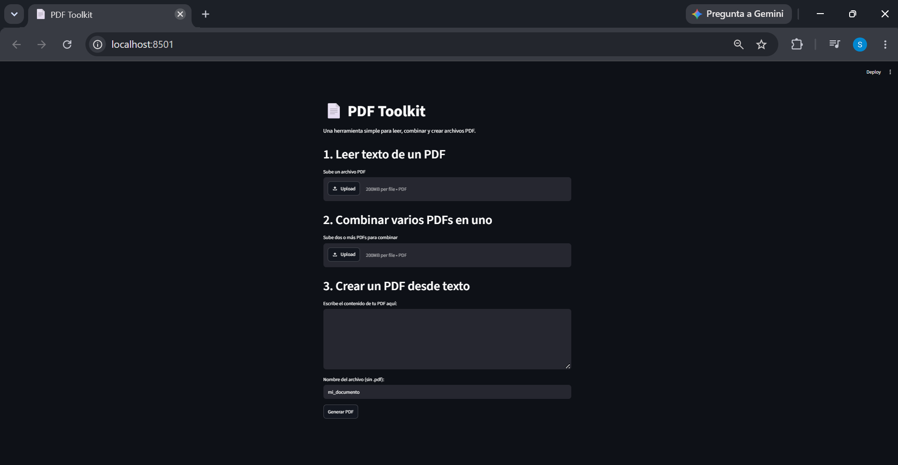
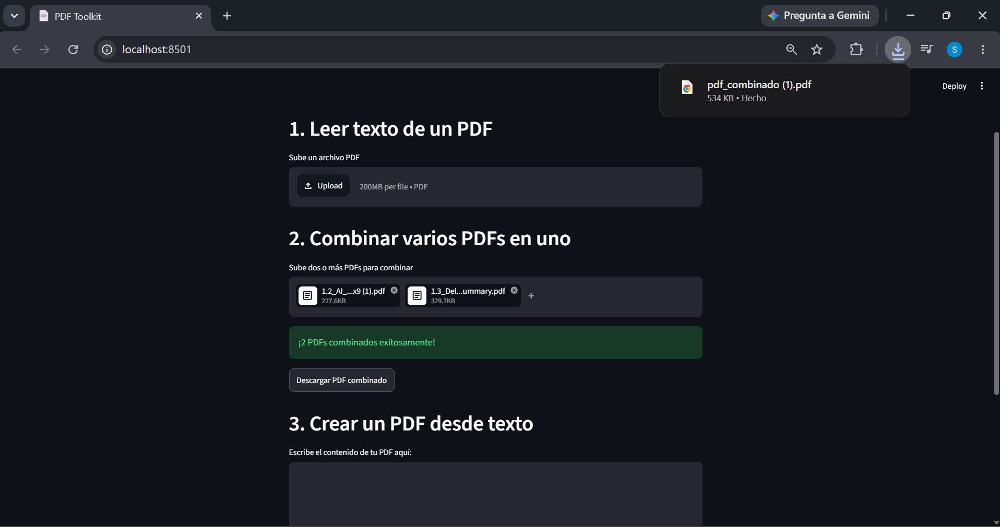

# 📄 PDF Toolkit

Una aplicación web simple hecha con Python y Streamlit para leer, combinar y crear archivos PDF.

## 🚀 Funcionalidades

- **Leer PDF**: sube un archivo PDF y extrae todo su texto.
- **Combinar PDFs**: une varios archivos PDF en uno solo.
- **Crear PDF**: genera un PDF nuevo a partir de texto escrito por el usuario.

## 🛠️ Tecnologías utilizadas

- [Python](https://www.python.org/)
- [Streamlit](https://streamlit.io/) — interfaz web
- [pypdf](https://pypi.org/project/pypdf/) — lectura y combinación de PDFs
- [reportlab](https://pypi.org/project/reportlab/) — creación de PDFs

## 📸 Capturas de pantalla

## 📸 Capturas de pantalla

### Vista general


### Leer texto de un PDF


### Combinar PDFs


## ⚙️ Instalación y uso local

1. Clona este repositorio:
```bash
   git clone https://github.com/TU-USUARIO/pdf-toolkit.git
   cd pdf-toolkit
```

2. Crea un entorno virtual e instálalo:
```bash
   python -m venv venv
   venv\Scripts\activate      # Windows
   pip install -r requirements.txt
```

3. Corre la aplicación:
```bash
   streamlit run app.py
```

## 👤 Autor

**Sadyr Robles**  
Estudiante de Ingeniería, enfocado en Ciencia de Datos e IA.